# 🧠 SmartInventory AI

> **Real-Time Inventory Alerting System & AI Chihbot Assistant**
> 
> A dual-architecture platform combining **Google Cloud Pub/Sub** for millisecond-latency alerts with **LangChain + RAG** for intelligent inventory queries.

[](https://cloud.google.com/pubsub)
[](https://langchain.com/)
[](https://gradio.app/)
[](https://python.org)

---

## 🚀 Live Demo

**Run the AI Control Center:**
```bash
python app_gradio.py
```

**Key Features:**
- 🤖 **AI Assistant**: RAG-powered chatbot with "Self-Awareness" of its own dataset.
- 📱 **2-Way Telegram Bot**: Full remote control—chat with your inventory from anywhere.
- 🔍 **Dataset Explorer**: Focused, full-screen "actual form" viewer for the entire database.
- ⚡ **Real-Time Alerts**: Instant Telegram notifications for low stock and high-value sales.
- 🏭 **Supplier Intelligence**: Automatic retrieval of contact details for reordering.
- 🔐 **Enhanced UI Security**: Configure API keys and Bot credentials directly in the app with secure "Eye" toggles.

---

## 🤖 AI Inventory Assistant & Remote Hub

Transform your inventory management with a central AI hub and mobile remote control.

Interact with your inventory using the RAG-powered chatbot:

**Capabilities:**
- 🔍 **Natural Language Search**: "Show me low stock items"
- 🏭 **Supplier Info**: "Who supplies Winter Jackets?"
- 📦 **Reorder Analysis**: "Should I reorder SKU005?"
- 💡 **RAG Integration**: Retrieves real context from `knowledge_base/`


---

## 📊 Architecture

```mermaid
flowchart LR
    subgraph Source["🏪 Retail Hub"]
        PUB["📤 publisher.py<br/>(Event Simulator)"]
        DAT["🔍 Dataset Explorer<br/>(Full-Screen View)"]
    end
    
    subgraph GCP["☁️ Google Cloud Platform"]
        TOPIC["📬 Pub/Sub Topic<br/>(live-sales)"]
        CF["⚡ Cloud Function<br/>(process_alert)"]
    end
    
    subgraph AI["🤖 AI Engine"]
        RAG["📚 RAG / ChromaDB"]
        LLM["🧠 GPT-4 / LangChain"]
        UI["💬 Gradio UI"]
    end
    
    subgraph Remote["📲 Remote Control"]
        TG["📱 Telegram Bot<br/>(2-Way Messaging)"]
    end
    
    PUB -->|Stream JSON| TOPIC
    TOPIC -->|Trigger| CF
    CF -->|Outgoing Alert| TG
    TG -->|Inbound Command| AI
    DAT <-->|Sync| AI
    RAG <-->|Context| LLM
    LLM <-->|Chat| UI
```



---

## ⚡ Unified Operation Flow

| Mode | Component | Description |
|------|-----------|-------------|
| 🏹 | **Control Center** | Direct chat with AI via Gradio web interface |
| 📱 | **Remote Command** | Chat with AI via Telegram (Long Polling) |
| 🕵️ | **Dataset Explorer** | Full-screen data view for deep inspection |
| 🔔 | **Real-Time Alerts** | Auto-notifications pushed to Telegram |

---

## 🚀 Quick Start

### 1. Configure Environment
Create a `.env` or use the dedicated **Settings** panel in the UI:
- **OpenAI API Key**: For natural language processing
- **Telegram Token**: From [@BotFather](https://t.me/botfather)
- **Chat ID**: From [@userinfobot](https://t.me/userinfobot)

### 2. Run the Hub
```bash
pip install -r requirements.txt
python app_gradio.py
```

### 3. (Optional) Simulate Sales
```bash
# Run the publisher to generate low stock/high value stream
python publisher.py --interval 5
```

---

## ⚙️ App Settings & Data Persistence

The app features a built-in **Settings & Data** panel where you can:
- **Toggle Visibility**: Securely view/hide credentials.
- **Save Permanent**: Store configuration locally (`config.json`).
- **Upload Datasets**: Hot-reload the AI with your own CSV/JSON files.
- **Telegram Setup**: Step-by-step instructions for bot integration.

---

## 📄 License

MIT License
