# ⚡ Real-Time Inventory Alerting System

> An event-driven streaming architecture for sub-second inventory monitoring using Google Cloud Pub/Sub and serverless Cloud Functions.

[](https://cloud.google.com/pubsub)
[](https://cloud.google.com/functions)
[](https://python.org)
[](https://core.telegram.org/bots/api)

---

## 📊 Architecture

```mermaid
flowchart LR
    subgraph Source["🏪 Retail POS"]
        PUB["📤 publisher.py<br/>(Event Simulator)"]
    end
    
    subgraph GCP["☁️ Google Cloud Platform"]
        TOPIC["📬 Pub/Sub Topic<br/>(live-sales)"]
        CF["⚡ Cloud Function<br/>(process_sale_event)"]
    end
    
    subgraph Actions["🔔 Alert Channels"]
        TG["📱 Telegram Bot<br/>(Instant Alerts)"]
        BQ["📊 BigQuery<br/>(Audit Logs)"]
    end
    
    PUB -->|JSON Events| TOPIC
    TOPIC -->|Trigger| CF
    CF -->|High Value / Low Stock| TG
    CF -.->|Optional| BQ
```



---

## ⚡ Event Flow

| Step | Component | Description |
|------|-----------|-------------|
| 1️⃣ | `publisher.py` | Simulates POS sales events in real-time |
| 2️⃣ | Pub/Sub Topic | Receives and buffers JSON messages |
| 3️⃣ | Cloud Function | Processes events with <100ms latency |
| 4️⃣ | Telegram Bot | Sends instant alerts to your phone |

---

## 🔔 Alert Types

### 🚀 High-Value Transaction
Triggered when `total > $120`

```
🚀 High-Value Sale Detected!

💰 Amount: $299.98
📦 Product: Winter Jacket
🏪 Store: Berlin_01
📁 Category: Jacket

🕒 2026-02-04T11:30:00
```

### ⚠️ Low Stock Warning
Triggered when `stock < 5 units`

```
⚠️ Low Stock Alert!

📦 Product: White Sneakers
📊 Remaining: 3 units
🏪 Last Sale: Online_Store

🕒 2026-02-04T11:30:00
```

---

## 🛠️ Tech Stack

- **Messaging**: Google Cloud Pub/Sub
- **Compute**: Cloud Functions (Gen 2)
- **Alerting**: Telegram Bot API
- **Language**: Python 3.11

---

## 🚀 Quick Start

### 1. Setup Telegram Bot

1. Open Telegram and search for `@BotFather`
2. Send `/newbot` and follow the prompts
3. Copy your **Bot Token**
4. Message `@userinfobot` to get your **Chat ID**

### 2. Configure Environment

```bash
cp .env.example .env
# Edit .env with your credentials
```

### 3. Local Testing

```bash
# Install dependencies
pip install -r requirements.txt

# Run the publisher (simulates sales)
python publisher.py --interval 2

# In another terminal, test the function
python main.py
```

### 4. Deploy to GCP

```bash
# Create Pub/Sub topic
gcloud pubsub topics create live-sales

# Deploy Cloud Function
gcloud functions deploy process_sale_event \
    --gen2 \
    --runtime python311 \
    --trigger-topic live-sales \
    --region us-central1 \
    --set-env-vars TELEGRAM_BOT_TOKEN=xxx,TELEGRAM_CHAT_ID=xxx

# Test with publisher
python publisher.py --pubsub --project YOUR_PROJECT_ID
```

---

## 📁 Project Structure

```
ProjectB_Streaming_Alerts/
├── main.py              # Cloud Function entry point
├── publisher.py         # Pub/Sub event simulator
├── requirements.txt     # Python dependencies
├── .env.example         # Environment template
└── README.md
```

---

## ⚙️ Configuration

| Variable | Description | Default |
|----------|-------------|---------|
| `TELEGRAM_BOT_TOKEN` | Bot token from @BotFather | Required |
| `TELEGRAM_CHAT_ID` | Your Telegram chat ID | Required |
| `HIGH_VALUE_THRESHOLD` | Alert if total > this | 120 |
| `LOW_STOCK_THRESHOLD` | Alert if stock < this | 5 |

---

## 📈 Scaling Considerations

For production deployments:

1. **Replace in-memory stock**: Use **Firestore** or **Redis** for real stock levels
2. **Add dead-letter topic**: Handle failed messages gracefully
3. **Enable BigQuery sink**: Log all events for analytics
4. **Set up monitoring**: Use Cloud Monitoring for function metrics

---

## 📄 License

MIT License - Feel free to use for your portfolio!
